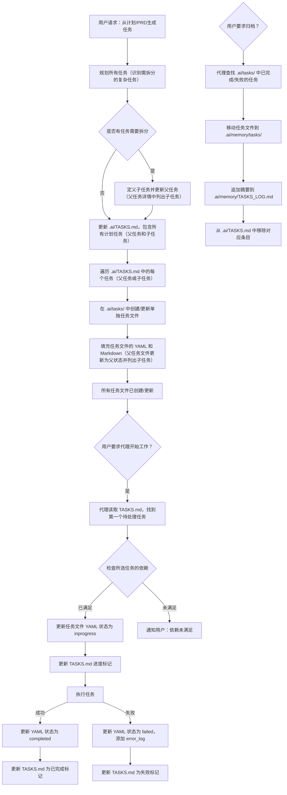

# Task Magic 工作流图

下方为 Task Magic 系统的工作流图，展示了任务创建、执行与归档的完整流程。

```mermaid
graph TD
    A[用户请求：从计划/PRD生成任务] --> B[规划所有任务（识别需拆分的复杂任务）]
    B --> B1{是否有任务需要拆分}
    B1 -- 是 --> B2[定义子任务并更新父任务（父任务详情中列出子任务）]
    B1 -- 否 --> C[更新 .ai/TASKS.md，包含所有计划任务（父任务和子任务）]
    B2 --> C
    C --> D[遍历 .ai/TASKS.md 中的每个任务（父任务或子任务）]
    D --> E[在 .ai/tasks/ 中创建/更新单独任务文件]
    E --> F[填充任务文件的 YAML 和 Markdown（父任务文件更新为父状态并列出子任务）]
    F --> G[所有任务文件已创建/更新]
    G --> H{用户要求代理开始工作？}
    H -- 是 --> I[代理读取 TASKS.md，找到第一个待处理任务]
    I --> J{检查所选任务的依赖}
    J -- 已满足 --> K[更新任务文件 YAML 状态为 inprogress]
    K --> L[更新 TASKS.md 进度标记]
    L --> M[执行任务]
    M -- 成功 --> N[更新 YAML 状态为 completed]
    N --> O[更新 TASKS.md 为已完成标记]
    M -- 失败 --> P[更新 YAML 状态为 failed，添加 error_log]
    P --> Q[更新 TASKS.md 为失败标记]
    J -- 未满足 --> R[通知用户：依赖未满足]
    S{用户要求归档？} --> T[代理查找 .ai/tasks/ 中已完成/失败的任务]
    T --> U[移动任务文件到 .ai/memory/tasks/]
    U --> V[追加摘要到 .ai/memory/TASKS_LOG.md]
    V --> W[从 .ai/TASKS.md 中移除对应条目]
``` 